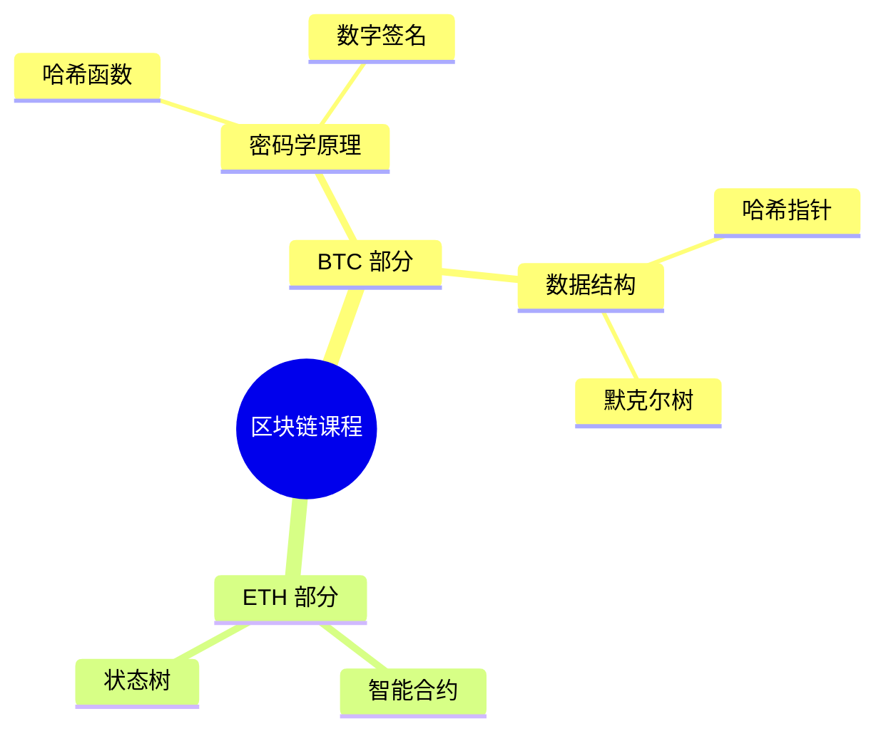

# YouTube 教程学习笔记生成器 - 使用教程

自动将 YouTube 播放列表转换为结构化的 Markdown 学习笔记。

## 📋 目录

- [快速开始](#快速开始)
- [详细配置](#详细配置)
- [使用方法](#使用方法)
- [输出结果](#输出结果)
- [常见问题](#常见问题)
- [高级用法](#高级用法)

## 🚀 快速开始

### 1. 安装依赖

```bash
pip install requests yt-dlp faster-whisper
```

### 2. 配置 Gemini API

编辑 `config.json`，填入您的 Gemini API Key：

```json
{
  "gemini": {
    "api_key": "你的API Key",
    "model": "gemini-2.5-flash"
  }
}
```

获取 API Key: https://aistudio.google.com/app/apikey

### 3. 配置 YouTube Cookies

**必需步骤**：YouTube 需要登录验证

1. 安装 Chrome 扩展：**"Get cookies.txt LOCALLY"**
2. 登录 YouTube
3. 导出 cookies.txt（详见 [COOKIES.md](COOKIES.md)）
4. 将文件放到技能根目录

### 4. 运行

```bash
cd ~/.claude/skills/youtube-tutorial-notes
python3 process_playlist.py
```

## ⚙️ 详细配置

### config.json 说明

```json
{
  "gemini": {
    "api_key": "YOUR_API_KEY",
    "model": "gemini-2.5-flash"
  }
}
```

- `api_key`: Gemini API 密钥（必需）
- `model`: 使用的模型（默认 gemini-2.5-flash）

### playlist_new.txt 格式

每行一个视频，格式：`标题|||URL`

```
01 课程介绍|||https://www.youtube.com/watch?v=xxxxx
02 第二课|||https://www.youtube.com/watch?v=yyyyy
```

**获取播放列表的方法**：

```bash
# 使用 yt-dlp 自动生成
yt-dlp --flat-playlist --print "%(title)s|||%(url)s" "播放列表URL" > playlist_new.txt
```

## 📖 使用方法

### 方法一：处理完整播放列表（推荐）

```bash
python3 process_playlist.py
```

特点：
- ✅ 自动处理所有视频
- ✅ 支持断点续传
- ✅ 自动生成思维导图

### 方法二：使用原子化脚本

#### 1. 下载音频

```bash
python3 scripts/download_video.py "https://www.youtube.com/watch?v=VIDEO_ID"
```

输出：`temp_videos/视频标题.webm`

#### 2. 转录音频

```bash
python3 scripts/transcribe_audio.py "temp_videos/音频.webm" "transcript.txt"
```

输出：转录文本文件

#### 3. Review 转录（可选）

```bash
python3 scripts/review_transcript.py "transcript.txt" "reviewed.txt"
```

使用 AI 修正错别字

#### 4. 生成笔记

```bash
python3 scripts/generate_notes.py "reviewed.txt" "视频标题" "note.md"
```

输出：Markdown 笔记

#### 5. 生成思维导图

```bash
python3 scripts/generate_mindmap.py
```

读取所有笔记，生成思维导图

## 📂 输出结果

### 目录结构

```
tutorial_notes/
├── notes/                 # 学习笔记
│   ├── 00_思维导图.md     # 自动生成的思维导图
│   ├── 01_课程介绍.md
│   ├── 02_第二课.md
│   └── ...
├── transcripts/           # 转录文本
│   ├── 01_transcript.txt
│   ├── 02_transcript.txt
│   └── ...
└── progress.json         # 进度记录
```

### 笔记格式示例

```markdown
# 02_BTC 密码学原理

## 核心知识点

### 知识点1：哈希函数性质
**核心内容**：
密码学哈希函数具备抗碰撞性和谜题友好性。

**关键细节**：
- 抗碰撞性：难以找到相同哈希值的两个输入
- 谜题友好性：没有捷径找到特定哈希值
- 难解易验：计算困难，验证容易
```

### 思维导图示例



## ❓ 常见问题

### Q1: 下载失败 "Sign in to confirm"

**原因**: cookies.txt 过期或无效

**解决**:
1. 重新导出 cookies.txt
2. 确保在 YouTube 登录状态
3. 替换旧文件后重试

### Q2: 转录速度很慢

**说明**:
- 使用 base 模型（最快）
- 每10分钟音频约需5-10分钟
- CPU 密集型任务

**优化**:
- 只处理重点视频
- 考虑使用 GPU（需修改代码）

### Q3: Gemini API 报错

**常见错误**:
- API key 无效
- 网络连接问题
- API 限流

**解决**:
1. 检查 API key 是否正确
2. 检查网络连接
3. 等待几分钟后重试

### Q4: 中断后如何继续

**方法**: 直接重新运行 `process_playlist.py`

脚本会：
- ✅ 跳过已生成的笔记
- ✅ 使用已下载的音频
- ✅ 从中断处继续

### Q5: 如何只处理部分视频

**方法**: 编辑 `playlist_new.txt`

1. 删除不需要的视频行
2. 保留要处理的视频
3. 运行 `process_playlist.py`

### Q6: 磁盘空间不足

**方法**: 脚本会自动删除音频文件

处理流程：
- 下载音频 → 转录 → 生成笔记 → **删除音频**

每个视频约 10-50MB（临时占用）

## 🔧 高级用法

### 1. 自定义笔记格式

编辑 `scripts/generate_notes.py` 中的 `prompt` 变量

### 2. 使用其他转录模型

修改 `scripts/transcribe_audio.py` 中的模型设置

### 3. 批量处理多个播放列表

```bash
# 处理第一个列表
cp playlist1.txt playlist_new.txt
python3 process_playlist.py
mv tutorial_notes notes1

# 处理第二个列表
cp playlist2.txt playlist_new.txt
python3 process_playlist.py
mv tutorial_notes notes2
```

### 4. 只生成思维导图

如果已有笔记文件：

```bash
python3 scripts/generate_mindmap.py
```

### 5. 检查进度

```bash
cat tutorial_notes/progress.json
```

输出示例：
```json
{
  "current": 7,
  "total": 28,
  "last_video": "07 BTC 挖矿难度",
  "timestamp": "2025-01-31 12:17:17"
}
```

## 💡 使用技巧

1. **后台运行**: 使用 `nohup` 或 `screen` 让脚本在后台运行
2. **选择性处理**: 编辑 playlist_new.txt，只保留重点课程
3. **备份笔记**: 定期备份 `tutorial_notes/` 目录
4. **版本控制**: 使用 Git 管理笔记，追踪修改历史
5. **合并笔记**: 手动编辑思维导图，添加个人理解

## 📊 性能参考

基于实际测试：

| 视频时长 | 下载时间 | 转录时间 | 生成时间 | 总计 |
|---------|---------|---------|---------|------|
| 10分钟  | 1分钟   | 5分钟   | 30秒    | 7分钟 |
| 20分钟  | 2分钟   | 10分钟  | 45秒    | 13分钟 |
| 30分钟  | 3分钟   | 15分钟  | 60秒    | 19分钟 |

## 🆘 获取帮助

如遇问题：
1. 查看本文档的常见问题部分
2. 检查 `SKILL.md` 了解完整功能
3. 查看 `COOKIES.md` 了解 cookies 配置
4. 检查 `tutorial_notes/README.md` 了解输出结构

## 📝 更新日志

- **v2.2.0** (2025-01-31): 改为下载音频，添加智能缓存
- **v2.1.0** (2025-01-21): 添加 review 步骤
- **v2.0.0** (2025-01-19): 初始版本

---

**享受学习！** 📚✨
