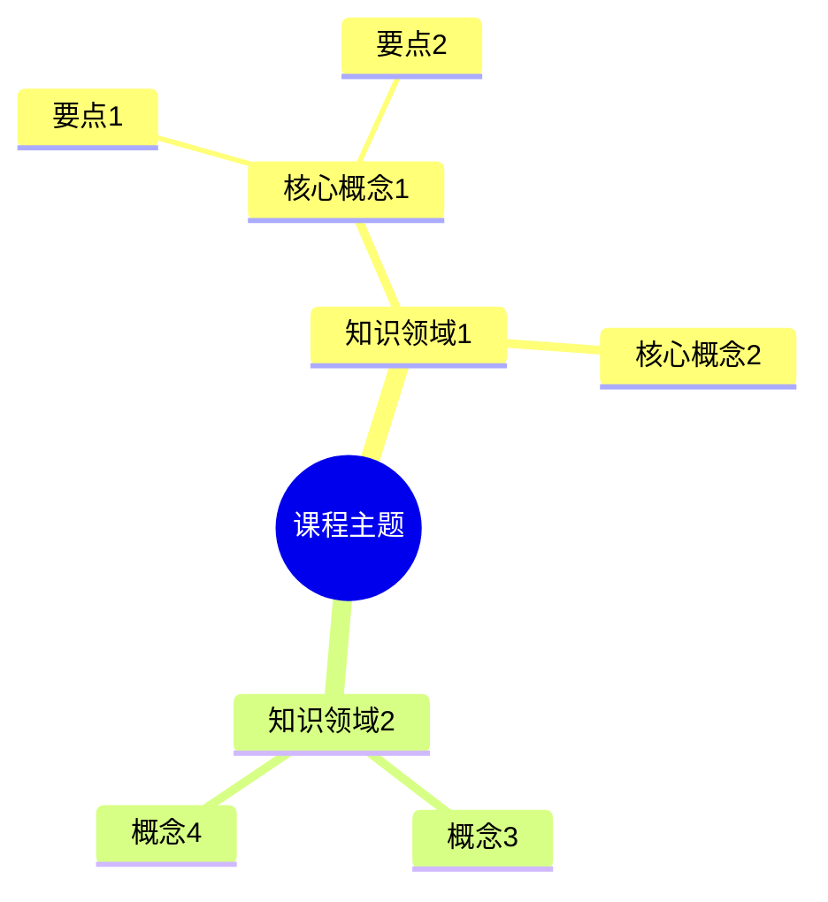

# YouTube 教程学习笔记生成器

将 YouTube 教程播放列表转换为**结构化的 Markdown 学习笔记**。采用音频下载+转录+AI生成方案，逐个视频顺序处理，支持断点续传。

## 核心特性

- **🎵 音频下载**: 自动下载 YouTube 音频（非视频，更快更省空间）
- **🔊 音频转录**: faster-whisper 本地转录，快速准确（中文支持）
- **🤖 AI 生成**: Gemini 2.5 Flash 生成精简笔记
- **📝 纯净内容**: 只记录核心知识点，去除冗余
- **🔍 智能修正**: 自动review转录文本，修正错别字
- **🧠 思维导图**: 所有笔记完成后自动生成精简思维导图
- **🔄 断点续传**: 支持中断后继续，自动跳过已处理视频
- **💾 智能缓存**: 自动检测已下载的音频文件

## 快速开始

### 1. 安装依赖

```bash
pip install requests yt-dlp faster-whisper
```

### 2. 配置 API 和 Cookies

**配置 Gemini API:**

创建 `config.json`：

```json
{
  "gemini": {
    "api_key": "你的Gemini API Key",
    "model": "gemini-2.5-flash"
  }
}
```

获取 API Key: [Google AI Studio](https://aistudio.google.com/app/apikey)

**配置 YouTube Cookies（必需）:**

由于 YouTube 有机器人检测，需要配置 cookies.txt 文件：

1. 安装 Chrome 扩展：**"Get cookies.txt LOCALLY"**
   - 访问 [Chrome 网上应用店](https://chrome.google.com/webstore/detail/get-cookiestxt-locally/cclelndahbckbenkjhflpdbanldgopeb)
2. 在 YouTube 登录账号
3. 点击扩展图标，选择 "Export" 导出 cookies.txt
4. 将 cookies.txt 文件放到技能根目录（与 config.json 同级）

**重要**: cookies.txt 文件是必需的，否则无法下载 YouTube 音频。

### 3. 使用方法

**处理整个播放列表：**

```bash
# 切换到技能目录
cd ~/.claude/skills/youtube-tutorial-notes

# 运行处理脚本
python3 process_playlist.py
```

脚本会自动：
1. 检查并使用已下载的音频文件
2. 下载缺失的音频
3. 逐个转录、review、生成笔记
4. 自动生成思维导图

## 处理流程

### 单个视频处理流程

```
检查音频文件 → 下载（如需要）→ 转录 → Review修正 → 生成笔记 → 删除音频
```

### 完整处理流程

`process_playlist.py` 主脚本：

```python
# 1. 解析播放列表
videos = parse_playlist("playlist_new.txt")

# 2. 逐个处理视频
for idx, video in enumerate(videos, start=1):
    # 检查是否已有音频文件
    if audio_file_exists(video['title']):
        audio_file = find_existing_audio(video['title'])
    else:
        audio_file = download_audio(video['url'])

    # 转录
    transcript = transcribe_audio(audio_file)

    # Review修正
    reviewed = review_transcript(transcript)

    # 生成笔记
    notes = generate_notes(reviewed, video['title'])

    # 保存
    save_transcript(reviewed, f"transcripts/{idx:02d}_transcript.txt")
    save_notes(notes, f"notes/{idx:02d}_{video['title']}.md")

    # 删除音频文件
    cleanup(audio_file)

# 3. 生成思维导图
generate_mindmap()
```

## 输出示例

### 目录结构

```
~/.claude/skills/youtube-tutorial-notes/
├── config.json              # Gemini API 配置
├── cookies.txt              # YouTube cookies（必需）
├── playlist_new.txt         # 播放列表信息
├── process_playlist.py      # 主处理脚本
├── scripts/                 # 原子化脚本
│   ├── download_video.py
│   ├── transcribe_audio.py
│   ├── review_transcript.py
│   ├── generate_notes.py
│   └── generate_mindmap.py
└── tutorial_notes/          # 输出目录
    ├── progress.json        # 进度文件
    ├── transcripts/         # 转录文本
    │   ├── 01_transcript.txt
    │   ├── 02_transcript.txt
    │   └── ...
    └── notes/               # 学习笔记
        ├── 00_思维导图.md
        ├── 01_XXX课程介绍.md
        ├── 02_XXX主题名称.md
        └── ...
```

### 笔记格式

```markdown
# 02_XXX主题名称

## 核心知识点

### 知识点1：XXX概念名称
**核心内容**：
XXX概念的精简描述（基于课程内容）

**关键细节**：
- 要点1：具体说明
- 要点2：具体说明
- 要点3：具体说明
```

### 思维导图格式



## 原子化脚本

### download_video.py
下载单个YouTube音频

```bash
python scripts/download_video.py "https://www.youtube.com/watch?v=VIDEO_ID"
```

### transcribe_audio.py
转录音频为文本

```bash
python scripts/transcribe_audio.py "audio.webm" "transcript.txt"
```

### review_transcript.py
修正转录文本错别字

```bash
python scripts/review_transcript.py "transcript.txt" "reviewed.txt"
```

### generate_notes.py
从转录生成精简笔记

```bash
python scripts/generate_notes.py "transcript.txt" "标题" "output.md"
```

### generate_mindmap.py
生成思维导图（读取所有笔记）

```bash
python scripts/generate_mindmap.py
```

## 系统要求

- **Python**: 3.8+
- **Node.js**: 用于 JavaScript 运行时（yt-dlp 需要）
- **磁盘空间**: 至少 500MB（临时音频存储）
- **内存**: 4GB+
- **网络**: 稳定的互联网连接

## 性能指标

- **下载速度**: 约 1-5 MB/s（取决于网络）
- **转录速度**: 约 5-10 分钟/小时音频
- **笔记生成**: 约 30-60 秒/视频
- **总计**: 每20分钟视频约需 8-15 分钟

## 常见问题

### Q: 下载失败（Sign in to confirm）
**A**: 需要刷新 cookies.txt 文件：
   - 重新导出 cookies.txt
   - 替换旧文件
   - 重新运行脚本

### Q: SSL 错误或网络问题
**A**: 脚本已配置重试机制，如持续失败：
   - 检查网络连接
   - 稍后重试
   - 检查 cookies.txt 是否过期

### Q: 中断后如何继续
**A**: 直接重新运行 `process_playlist.py`，脚本会：
   - 自动跳过已生成的笔记
   - 使用已下载的音频文件
   - 从中断处继续

### Q: 转录速度慢
**A**:
   - 默认使用 `base` 模型（最快）
   - 可考虑使用 GPU 加速
   - 或只处理部分重点视频

### Q: Gemini API 错误
**A**:
   - 检查 API key 是否有效
   - 检查网络连接
   - 等待片刻后重试（API 限流）

## 成本估算

- **faster-whisper**: 免费（本地运行）
- **yt-dlp**: 免费（开源工具）
- **Gemini 2.5 Flash**: 约 $0.05-0.10/28个视频（约¥0.4-0.8）
- **总计**: 每个播放列表约 ¥0.5-1.0

## 使用技巧

1. **批量处理**: 一次性运行 process_playlist.py，让它自动处理所有视频
2. **断点续传**: 随时可以中断（Ctrl+C），重新运行会继续
3. **进度跟踪**: 查看 `tutorial_notes/progress.json` 了解当前进度
4. **手动干预**: 可以手动将已有音频放入 `temp_videos/` 目录
5. **选择性处理**: 删除 playlist_new.txt 中不需要的视频行

## 更新日志

- **v2.2.0** (2025-01-31):
  - 改为下载音频（非视频），节省空间和时间
  - 添加智能缓存机制，自动检测已有音频
  - 优化断点续传功能
  - 更新文档，添加 cookies.txt 配置说明
- **v2.1.0** (2025-01-21): 添加 review 步骤，优化笔记和思维导图精简度
- **v2.0.0** (2025-01-19): 重构为原子化架构
