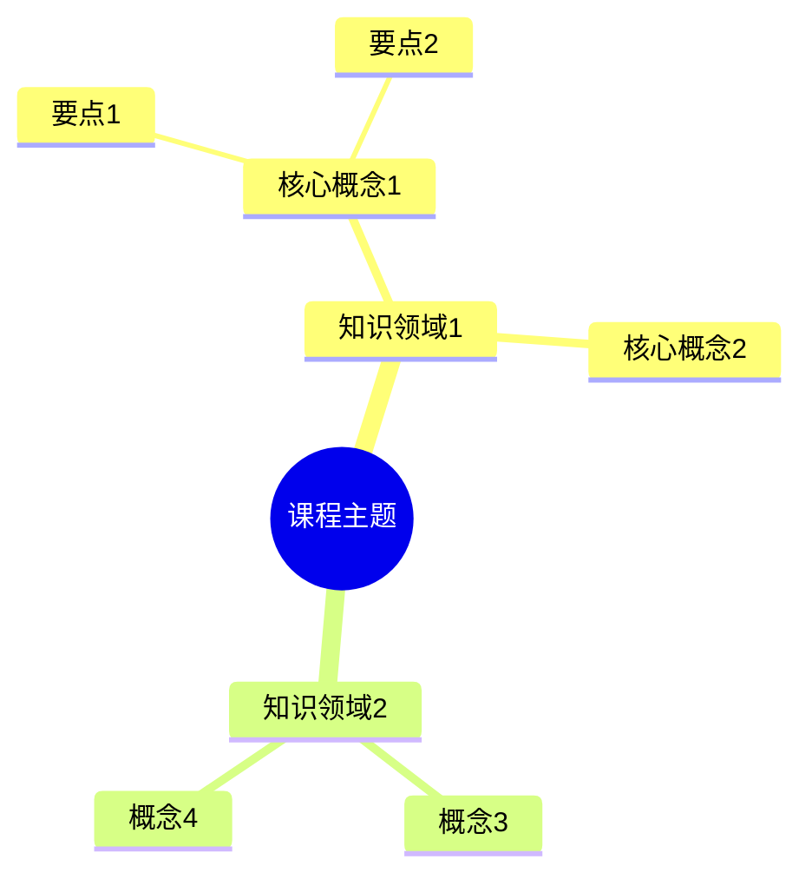

# YouTube 教程学习笔记生成器

将 YouTube 教程播放列表转换为**结构化的 Markdown 学习笔记**。脚本负责下载和转录，AI 负责生成笔记和思维导图。

## 核心特性

- **音频下载**: 自动下载 YouTube 音频
- **本地转录**: faster-whisper 本地转录，快速准确
- **AI 生成笔记**: 由 Claude 直接生成精简笔记，无需额外 API
- **并行处理**: 多视频通过 subagent 并行生成笔记
- **断点续传**: 支持中断后继续，自动跳过已处理视频
- **思维导图**: 所有笔记完成后自动生成 Mermaid 思维导图

## 快速开始

### 1. 安装依赖

```bash
pip install -r requirements.txt
```

### 2. 配置 YouTube Cookies（必需）

由于 YouTube 有机器人检测，需要配置 cookies.txt 文件：

1. 安装 Chrome 扩展：**"Get cookies.txt LOCALLY"**
2. 在 YouTube 登录账号
3. 点击扩展图标，选择 "Export" 导出 cookies.txt
4. 将 cookies.txt 文件放到技能根目录（与 config.json 同级）

详细步骤见 `COOKIES.md`。

### 3. 配置转录参数（可选）

编辑 `config.json`：

```json
{
  "transcription": {
    "model_size": "base",
    "device": "cpu",
    "language": "auto"
  }
}
```

- `model_size`: tiny/base/small/medium/large，越大越准确但越慢
- `device`: cpu 或 cuda
- `language`: zh/en/auto，auto 表示自动检测

### 4. 使用方法

**处理整个播放列表：**

1. 将播放列表视频信息写入 `playlist_new.txt`（格式：`视频标题 ||| 视频URL`，每行一个）
2. 运行脚本：

```bash
cd ~/.claude/skills/youtube-tutorial-notes
python3 process_playlist.py
```

脚本会自动：
1. 检查并使用已下载的音频文件
2. 下载缺失的音频
3. 逐个转录为文本
4. 保存转录文件到 `tutorial_notes/transcripts/`
5. 生成 `tutorial_notes/transcripts/manifest.json`

**生成笔记和思维导图**：脚本完成后，按以下步骤处理（详见下文）。

## 工作流程

### 阶段一：下载+转录（脚本完成）

```bash
python3 process_playlist.py
```

完成后会生成：
- `tutorial_notes/transcripts/` — 每个视频的转录文本
- `tutorial_notes/transcripts/manifest.json` — 视频元数据（标题、URL、转录文件路径）
- `tutorial_notes/progress.json` — 处理进度

### 阶段二：生成笔记（Claude agent 完成）

1. 读取 `tutorial_notes/transcripts/manifest.json`，获取所有视频信息
2. 检查 `tutorial_notes/notes/` 目录，跳过已生成的笔记
3. **并行处理**：分发给 subagent，每批最多 3 个，每个负责 1-2 个视频
4. 每个 subagent 读取对应的转录文件，生成笔记并保存到 `tutorial_notes/notes/`

**笔记格式**：

```markdown
# 视频标题

## 核心知识点

### 知识点1：概念名称
**核心内容**：精简描述概念和要点（基于转录文本）

**关键细节**：重要的细节、公式或代码（如有）

### 知识点2：...
...
```

**笔记生成原则**：
- 只记录核心知识点，去除冗余
- 不添加课程概述、总结等非必要内容
- 只基于转录文本中的内容，不添加外部知识
- 不编造课程中未提及的公式、代码或例子
- 内容精简，直击要害

### 阶段三：生成思维导图（Claude agent 完成）

1. 读取 `tutorial_notes/notes/` 目录下所有笔记文件（排除 `00_*.md`）
2. 综合分析所有笔记，生成 Mermaid 思维导图
3. 保存为 `tutorial_notes/notes/00_思维导图.md`

**思维导图格式**：


```mermaid
mindmap
  root((课程主题))
    知识领域1
      核心概念1
        要点1
        要点2
      核心概念2
    知识领域2
      概念3
      概念4
```

## 输出目录结构

```
tutorial_notes/
├── progress.json          # 处理进度
├── transcripts/           # 转录文本
│   ├── manifest.json      # 视频元数据
│   ├── 01_视频标题1.txt
│   ├── 02_视频标题2.txt
│   └── ...
└── notes/                 # 学习笔记
    ├── 00_思维导图.md
    ├── 01_视频标题1.md
    ├── 02_视频标题2.md
    └── ...
```

## 断点续传

- **阶段一断点续传**：重新运行 `process_playlist.py`，脚本会自动跳过已下载的音频
- **阶段二断点续传**：检查 `notes/` 目录，已存在的笔记自动跳过
- **阶段三断点续传**：如果笔记已生成，只需重新运行思维导图生成步骤

## 系统要求

- **Python**: 3.8+
- **yt-dlp**: YouTube 视频下载工具
- **faster-whisper**: 本地语音识别
- **磁盘空间**: 至少 500MB（临时音频存储）
- **内存**: 4GB+
- **网络**: 稳定的互联网连接

## 性能指标

- **转录速度**: 约 5-10 分钟/小时音频
- **笔记生成**: 约 30-60 秒/视频（单个）
- **并行加速**: 3 个 subagent 并行，约 10-15 秒/视频
- **总计**: 每个视频约需 10-15 分钟（含下载、转录、笔记）

## 常见问题

### Q: 下载失败（Sign in to confirm）
**A**: 需要刷新 cookies.txt 文件：重新导出 cookies.txt 并替换旧文件。

### Q: 转录结果不准确
**A**: 尝试使用更大的模型（small/medium）或启用 CUDA 加速。

### Q: 语言识别错误
**A**: 在 `config.json` 中明确指定 `language` 为 `zh` 或 `en`。

### Q: SSL 错误或网络问题
**A**: 检查网络连接，稍后重试。
